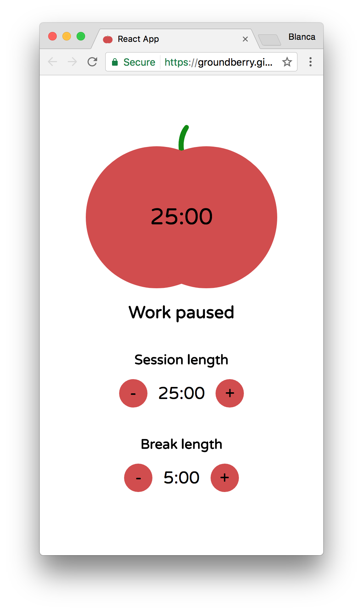

# Pomodoro

This project is part of the Free Code Camp's front-end track. I'll build a pomodoro clock using [React](https://facebook.github.io/react/).

## Functionality

- I can start the 25 min pomodoro.
- I can stop the pomodoro.
- The timer will go off when the 25 min has elapsed.
- I can reset the clock for my next pomodoro.
- I can customize the length of each pomodoro.




## Technologies used

The client side of the app is built with [React](https://facebook.github.io/react/). I used [Create React App](https://github.com/facebookincubator/create-react-app) to get it started.

For testing I used [Jest](https://github.com/facebook/jest).

## Challenges

*TDD* - I wanted to create this app following test-driven development (TDD). It was a challenge at the beginning, but it made it a lot easier to develop new features and ensure that I didn't break things when making a change.

## Running

Clone this repo:

```
$ git clone https://github.com/groundberry/react-pomodoro
```

Install all dependancies:

```
$ npm install
```

Start the server:

```
$ npm start
```

## Testing

Run the tests:

```
$ npm run test
```


